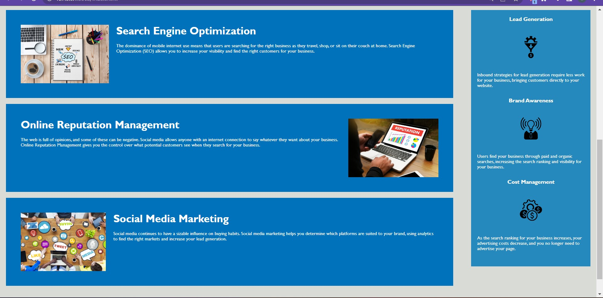

# Horiseon Marketing Agency Website Code Refactor

This project is a code refactor of the Horiseon Marketing Agency website to ensure that it meets accessibility standards. The main objective of this refactor is to improve the codebase for search engines while maintaining the existing functionality of the website.

## User Story

As a marketing agency, we want a codebase that follows accessibility standards so that our own site is optimized for search engines.

## Acceptance Criteria

The website must meet accessibility standards, which can be achieved by completing the following:

+ Semantic HTML elements can be found throughout the source code.
+ HTML elements follow a logical structure independent of styling and positioning.
+ Image and icon elements contain accessible alt attributes.
+ Heading attributes fall in sequential order.
+ Title elements contain a concise, descriptive title.

## Changes Made

The following changes were made to the codebase to meet the acceptance criteria:

+ Replaced non-semantic HTML elements with semantic ones.
+ Updated the HTML structure to follow a logical order.
+ Added alt attributes to all images and icons.
+ Updated heading attributes to fall in sequential order.
+ Updated the title element to be concise and descriptive.

## Result

The following image shows the web application's appearance and functionality:

The Horiseon webpage includes a navigation bar, a header image, and cards with text and images at the bottom of the page.

## Technologies Used
+ HTML
+ CSS
+ Git

## Credits

This project was completed as part of an edX Boot Camps LLC curriculum. The original codebase was provided by the curriculum, and the refactor was completed by Laly Firoze

## License
This project is licensed under the MIT License.